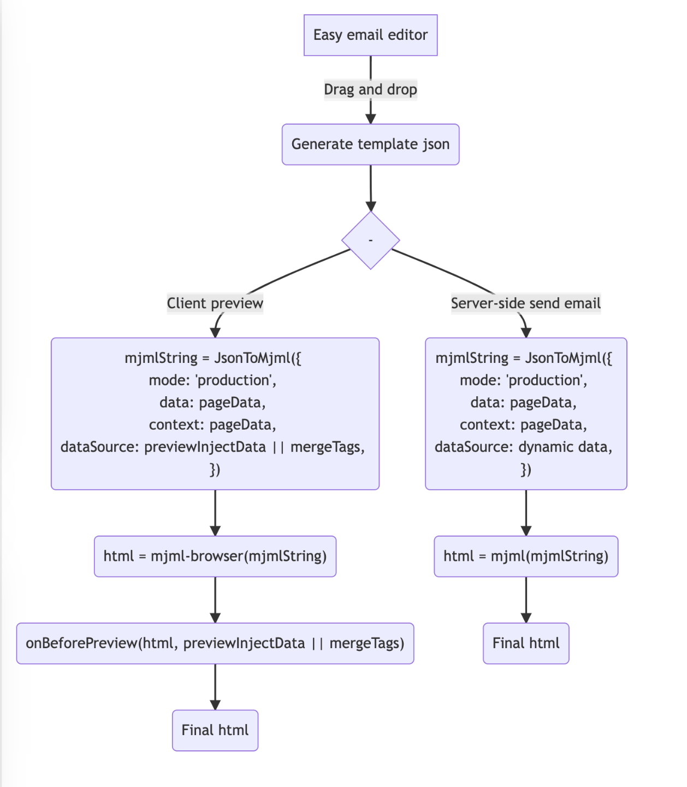

# Vikasit email editor

## How does it work?



</br>

## Custom Services
For customized features or paid consultation services, please contact 962491243@qq.com.


## Getting started

```sh
$ npm install --save vikasit-email-core vikasit-email-editor vikasit-email-extensions react-final-form
```

or

```sh
$ yarn add vikasit-email-core vikasit-email-editor vikasit-email-extensions react-final-form
```

```js
import React from 'react';
import { BlockManager, BasicType, AdvancedType } from 'vikasit-email-core';
import { EmailEditor, EmailEditorProvider } from 'vikasit-email-editor';
import { ExtensionProps, StandardLayout } from 'vikasit-email-extensions';
import { useWindowSize } from 'react-use';

import 'vikasit-email-editor/lib/style.css';
import 'vikasit-email-extensions/lib/style.css';

import '@arco-themes/react-easy-email-theme/css/arco.css';

const initialValues = {
  subject: 'Welcome to Vikasit-email',
  subTitle: 'Nice to meet you!',
  content: BlockManager.getBlockByType(BasicType.PAGE)!.create({}),
};

export default function App() {
  const { width } = useWindowSize();

  const smallScene = width < 1400;

  return (
    <EmailEditorProvider
      data={initialValues}
      height={'calc(100vh - 72px)'}
      autoComplete
      dashed={false}
    >
      {({ values }) => {
        return (
          <StandardLayout
            compact={!smallScene}
            showSourceCode={true}
          >
            <EmailEditor />
          </StandardLayout>
        );
      }}
    </EmailEditorProvider>
  );
}


```

## Examples

> Please see <a href="https://github.com/myvikasit/vikasit-email-demo" target="_blank" alt="https://github.com/myvikasit/vikasit-email-demo">https://github.com/myvikasit/vikasit-email-demo</a>

</br>

## Configuration

| property           | Type                                                                                               | Description                                                                                                                          |
| ------------------ | -------------------------------------------------------------------------------------------------- | ------------------------------------------------------------------------------------------------------------------------------------ |
| height             | string / number                                                                                    | Set the height of the container                                                                                                      |
| data               | interface IEmailTemplate { content: IPage; subject: string; subTitle: string; }                    | Source data                                                                                                                          |
| children           | ( props: FormState<T>,helper: FormApi<IEmailTemplate, Partial<IEmailTemplate>>) => React.ReactNode | ReactNode                                                                                                                            |
| onSubmit           | Config<IEmailTemplate, Partial<IEmailTemplate>>['onSubmit'];                                       | Called when the commit is triggered manually                                                                                         |
| fontList           | { value: string; label: string; }[];                                                               | Default font list.                                                                                                                   |
| interactiveStyle   | { hoverColor?: string; selectedColor?: string;}                                                    | Interactive prompt color                                                                                                             |
| onUploadImage      | (data: Blob) => Promise<string>;                                                                   | Triggered when an image is pasted or uploaded                                                                                        |
| onAddCollection    | (payload: CollectedBlock) => void;                                                                 | Add to collection list                                                                                                               |
| onRemoveCollection | (payload: { id: string; }) => void;                                                                | Remove from collection list                                                                                                          |
| dashed             | boolean                                                                                            | Show dashed                                                                                                                          |
| autoComplete       | boolean                                                                                            | Automatically complete missing blocks. For example, Text => Section, will generate Text=>Column=>Section                             |
| mergeTags          | Object                                                                                             | A merge tag is a bit of specific code that allows you to insert dynamic data into emails. Like `{{user.name}}`, and used for preview |
| previewInjectData  | Object                                                                                             | Dynamic data for preview, it will overwrite mergeTags.                                                                               |
| onBeforePreview    | (html: string, mergeTags: PropsProviderProps['mergeTags']) => string                               | Promise<string> You can replace mergeTags when previewing.                                                                           |

## Hotkeys

| hotkey            | Description                                                                                       |
| ----------------- | ------------------------------------------------------------------------------------------------- |
| mod+z             | undo                                                                                              |
| mod+y             | redo                                                                                              |
| delete/backspace  | delete block                                                                                      |
| tab / shift + tab | fast select block, if block is focusing,`tab` select next block & `shift + tab` select prev block |

## Packages

- [vikasit-email-core](./packages/vikasit-email-core/readme.md)
- [vikasit-email-editor](./packages/vikasit-email-editor/readme.md)
- [vikasit-email-extensions](./packages/vikasit-email-extensions/readme.md)

</br>

## Development

```sh
$ git clone git@github.com:myvikasit/vikasit-email-editor.git
$ cd vikasit-email


$ yarn
$ yarn install-all
$ yarn dev

```
`If you need some new features, we always welcome you to submit a PR.`

